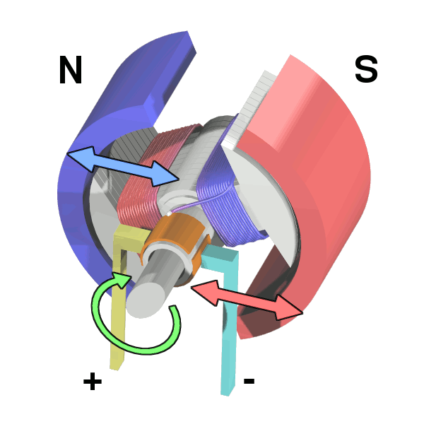
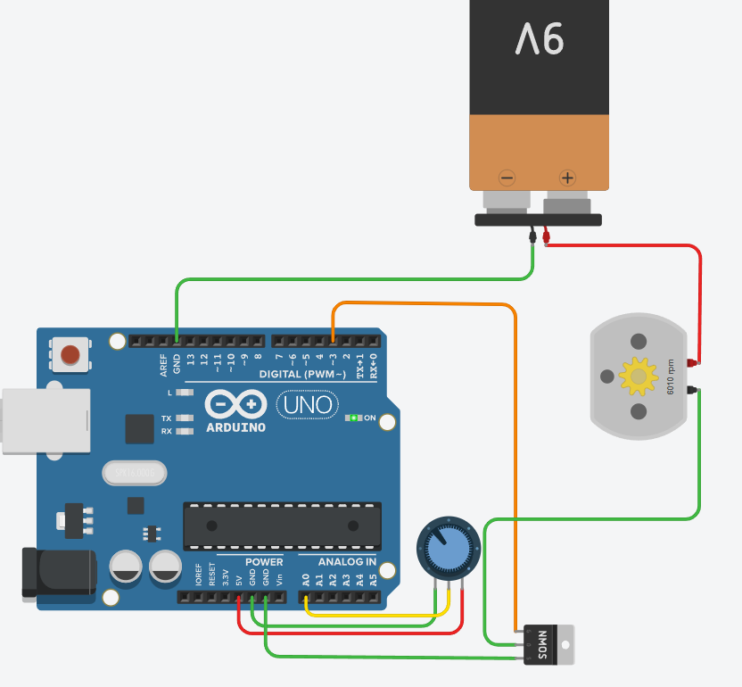
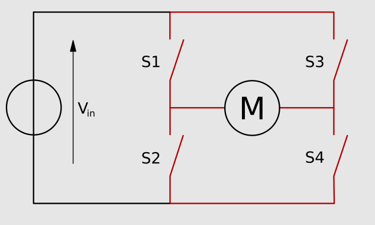
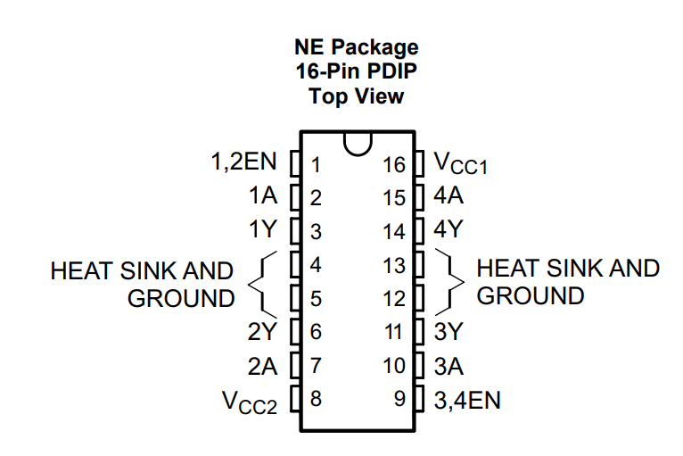
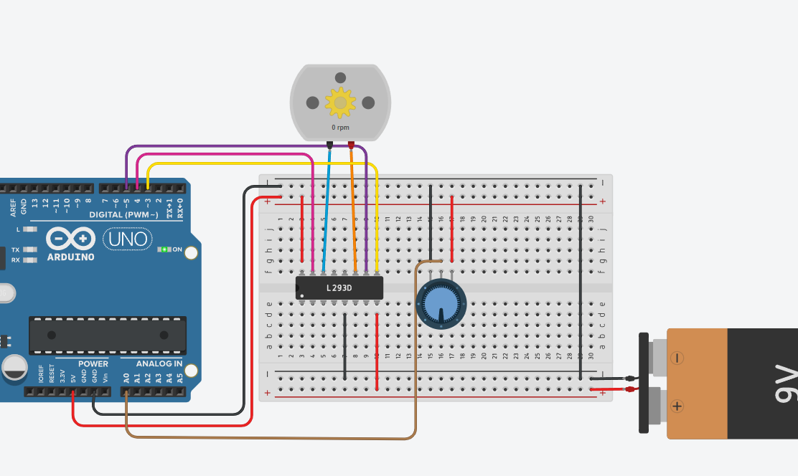

# Alalisvoolumootorid

Alalisvoolumootorid *(ingl Direct Current motor, DC-motor)* on elektromehaanilised seadmed, mis muundavad alalisvoolu elektrienergia pöörlevaks liikumiseks. Need mootorid töötavad magnetvälja ja elektrivoolu vastastikmõju põhimõttel ([Lorentzi jõud](https://et.wikipedia.org/wiki/Lorentzi_j%C3%B5ud)), kus rootor hakkab pöörlema, kui vool läbib mootori mähiseid. Alalisvoolumootoreid leidub mitmesugustes seadmetes, alates mänguasjadest kuni tööstusautomaatika lahendusteni. Arduino UNO-ga juhitavad alalisvoolumootorid on tavaliselt harjadega alaisvoolumootorid *(ingl Brushed DC-motor)*. Harjadega alaisvoolumootori täpsema tööpõhimõtte kohta saad lugeda [siit.](https://en.wikipedia.org/wiki/Brushed_DC_electric_motor)

*Allikas: https://commons.wikimedia.org/wiki/File:Electric_motor_cycle_3.png*

Alalisvoolumootori juhtimiseks Arduino UNO-ga kasutatakse tavaliselt [transistoripõhist](https://github.com/nullyks/Arduino-baaselemendid/blob/main/materjalid/3_transistorid.md) lülitust või mootoridraiverit, näiteks L293D. Need draiverid võimaldavad mootori suunda ja kiirust reguleerida PWM  signaali abil. PWM võimaldab muutuva voolu rakendamist mootorile, mis omakorda määrab pöörlemiskiiruse. Arduino UNO PWM viikudest rääkisime [siin.](https://github.com/nullyks/Arduino-sissejuhatus/blob/main/materjalid/3_Arduino_UNO_viigud.md) Mootori pöörlemissuuna muutmiseks kasutatakse H-silda, mis vahetab voolu suunda mähistes. Mõned mootorid on varustatud enkoodritega, mis võimaldavad täpsemat kiiruse ja asendi juhtimist.

Arduino UNO suudab ise genereerida juhtsignaale, kuid ei suuda pakkuda piisavat voolu enamikule mootoritele, mistõttu on mootoridraiver hädavajalik. Mootori toiteks kasutatakse sageli eraldi alalisvooluallikat, näiteks 6V–12V akusid või adaptereid. Lisaks tuleb arvestada mootori maksimaalse voolutarbega, et vältida ülekuumenemist või kahjustusi. Lisatoite kasutamise korral tuleb toiteallika miinusklemm ja Arduino GND viik alati omavahel ühendada.

## Alalisvoolumootori juhtimine MOSFET transistoriga

Kõige lihtsamal juhul saame alalisvoolumootorit juhtida ühe MOSFET [transistoriga](https://github.com/nullyks/Arduino-baaselemendid/blob/main/materjalid/3_transistorid.md). Ühest transistorist piisab mootori vooluringi lülitamiseks ja seda läbiva voolu tugevuse kontrollimiseks. Seega saame mõjutada ainult mootori pöörlemiskiirust, kuid mitte suunda. Näites saab kasutaja mootori pöörlemiskiiruse määrata potentsiomeetri asendiga. Näites kasutame N-kanaliga MOSFET transistorit.

### Ühe MOSFET transistoriga juhtimise näide

~~~cpp
#define gate 3 //selle viigu abil kontrollime MOSFET-i
#define pot A0 //selle viigu abil loeme potentsiomeetri asendi

void setup() {
	Serial.begin(9600);
    pinMode(gate, OUTPUT);
}

void loop() {
	int potValue=analogRead(pot); //loeme potentsiomeetri väärtuse
  	int motorValue=map(potValue,0,1023,0,255); //vastustame loetud väärtuse MOSFETi juhtimiseks sobivasse vahemikku
  	Serial.println(motorValue);
    analogWrite(gate, motorValue); //Paneme MOSFETi paisule määratud pinge, mis võimaldab voolul läbida mootori toiteahelat.
}
~~~
[Interaktiivne simulatsioon](https://www.tinkercad.com/things/aAgbmGxxBCX-alalisvoolumootor-transistoriga?sharecode=Arc8_eGUyrxYSLrNBUmZmxTYQaNH4XsKgko5yd7moFY)

## Alalisvoolumootori juhtimine L293D draiveriga
Eelmise näite puuduseks oli võimetus muuta mootori pöörlemissuunda. Pöörlemissuuna muutmiseks realiseerivad mootoridariverid H-silla. 
H-sild on vooluahel, mis võimaldab alalisvoolumootori pöörlemissuunda muuta, juhtides seda, millises suunas toitevool mootori läbib. 

See koosneb tavaliselt neljast transistorist või lülitist, mis on paigutatud H-kujuliselt – sellest ka nimetus H-sild. Kui kaks diagonaalis olevat transistori sisse lülitada, voolab vool läbi mootori ühes suunas, ja kui sisse lülitatakse teised kaks, pöördub voolu suund, muutes mootori pöörlemissuunda.

*(Allikas: https://commons.wikimedia.org/wiki/File:H_bridge.svg)*

| S1 | S2| S3 | S4 | Tulemus |
|:---:|:---:|:---:|:---:|:---|
| 1 | 0| 0 | 1 | Mootor pöörleb paremale |
| 0 | 1| 1 | 0 | Mootor pöörleb vasakule |
| 0 | 0| 0 | 0 | Mootor veereb vabalt |
| 0 | 1| 0 | 1 | Mootor pidurdab paremale |
| 1 | 0| 1 | 0 | Mootor pidurdab vasakule |
| 1 | 1| 0 | 0 | Lühis |
| 0 | 0| 1 | 1 | Lühis |
| 1 | 1| 1 | 1 | Lühis |

L293D mootoridraiver implementeerib kaks H-silda seega saab selle driveriga korraga juhtida kahte mootorit teineteisest sõltumatult, mis teeb draiveri kasulikuks näiteks roomikutega liikurplatvormi juhtimisel. Aga samuti sobib lihtsate kaherattaliste liikurplatvormide jaoks, kus vedavad rattad on platvormi vastaskülgedel.

### L293D ühendusskeem

*Allikas: https://www.ti.com/lit/ds/symlink/l293.pdf*

* **VCC1** - draiveri enda toide 5V
* **VCC2** - mootorite toide 4.5 - 36V
* **1,2EN** - vasakpoolse mootori sisselülitus (PWM-iga saab juhtida kiirust)
* **3,4EN** - parempoolse mootori sisselülitus (PWM-iga saag juhtida kiirust)
* **1Y** - vasakpoolse mootori üks klemm
* **2Y** - vasakpoolse mootori teine klemm
* **1A ja 2A** - juhivad vasakpoolse mootori suunda. Kui üks on HIGH, siis teine peab olema LOW.
* **3Y** - parempoolsemootori üks klemm
* **4Y** - parempoolse mootori teine klemm
* **3A ja 4A** - juhivad parempoolse mootori suunda. Kui üks on HIGH, siis teine peab olema LOW.
* **viigud 4,5,12,13** - maandus

**NB!** - voolutugevus kogu kiibi kohta, ei tohiks ületada 1.2A

### L293D draiveriga mootori juhtimise näide

Mootori pöörlemise suunda ja kiirust kontrollib [potentsiomeeter](https://github.com/nullyks/Arduino-baaselemendid/blob/main/materjalid/1_takistid.md). Keskmises asendis mootor seisab. Mida rohkem paremale on potentsiomeeter, seda kiiremini paremale mootor pöörleb ja mida rohkem vasakule on potentsiomeeter, seda kiiremini vasakule mootor pöörleb.

~~~cpp
#define pot A0 //selle viigu kaudu loeme potentsiomeetri asendi
#define kiirus 3 //see viik määrab mootori kiiruse
//Need viigud määravad mootori pöörlemissuuna (kui üks on HIGH, siis teine on LOW)
#define suund1 4
#define suund2 5

void setup()
{
  pinMode(kiirus, OUTPUT);
  pinMode(suund1, OUTPUT);
  pinMode(suund2, OUTPUT);
}

void loop()
{
  int potData=analogRead(pot); //loeme poteka väärtuse
  if(potData<500){ // kui väärtus on väiksem kui 500, siis pöörleb mootor vasakule
    digitalWrite(suund1, HIGH);
    digitalWrite(suund2, LOW);
    int mapValue=map(potData,0,499,255,0); // mida väiksem poteka näit seda suurem kiirus
    analogWrite(kiirus,mapValue);
  }
  if(potData>=500 && potData<=520){ //kui potekas on vahemikus 500 - 520, siis mootor seisab
     analogWrite(kiirus,0);
  }
  if(potData>520){ //kui potekas väärtus on üle 520, siis mootor pöörleb paremale
    digitalWrite(suund1, LOW);
    digitalWrite(suund2, HIGH);
    int mapValue=map(potData,521,1023,0,255); //mida suurem poteka näit, seda suurem kiirus
    analogWrite(kiirus,mapValue);
  }
}
~~~

[Interaktiivne simulatsioon](https://www.tinkercad.com/things/fjxmPUpN59m-l293d?sharecode=uxteCFtOcrfE4VWT_eUc0wMcFpKebon9JHcF5isJFJo)