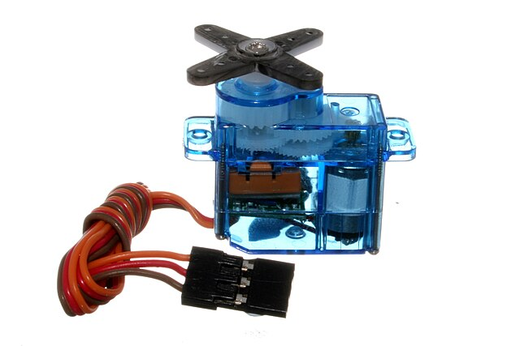
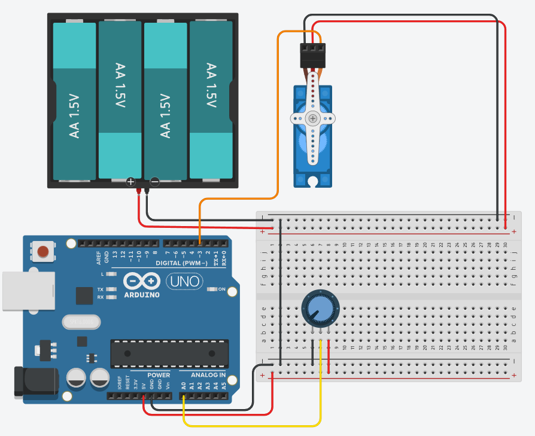

# Servomootorid

*Allikas: https://commons.wikimedia.org/wiki/File:Micro_servo.jpg*

Servomootorid on täpsed ja kontrollitavad mootorid, mida kasutatakse laialdaselt robootikas. Need mootorid koosnevad tavaliselt elektrimootorist, jõuülekandest ja juhtimissüsteemist, mis võimaldab nende positsiooni (pöördenurga) täpset määramist. Arduino UNO-ga saab servomootoreid juhtida PWM signaalide abil, kus impulsilaius määrab mootori asendi teatud vahemikus, tavaliselt 0–180 kraadi.

Arduino platvormil kasutatakse servomootorite juhtimiseks sageli Servo.h teeki, mis lihtsustab PWM-signaalide saatmist. Servo mootori signaalijuhe ühendatakse tavaliselt Arduino digitaalse PWM-väljundiga , toitejuhe  5V või välise toiteallikaga ning maandus GND viiguga. Juhtsignaali tüüpiline sagedus on 50 Hz ning impulsi laius varieerub umbes 1 ms (0°), 1,5 ms (90°) ja 2 ms (180°) vahel, kuigi täpne vahemik sõltub konkreetse mootori mudelist.

Lisaks tavalistele 0–180 kraadi servomootoritele on olemas ka 360 kraadi pöörlevad servod. Erinevalt tavalistest servodest ei kontrollita nende puhul asendit, vaid pöörlemiskiirust ja -suunda. Kui PWM-signaal on 1,5 ms lai, jääb mootor paigale; lühem impulss (nt 1 ms) põhjustab pöörlemise ühes suunas ja pikem impulss (nt 2 ms) teises suunas, kusjuures kaugus neutraalsest signaalist määrab pöörlemiskiiruse. Sellised servod sobivad hästi rakendustesse, kus on vaja pidevat pöörlemist.

Servomootoreid kasutatakse eelkõige rakendustes, kus on vaja täpset asendi kontrolli, näiteks robotkätes, kaugjuhitavates sõidukites, automaatikaseadmetes ja mehhanismides, mis vajavad täpset liikumist. Kuna servod tarbivad liikumisel rohkem voolu kui oma asendi hoidmisel, võib suuremate mootorite puhul vaja minna välist toiteallikat, et vältida Arduino ülekoormamist. Lisaks tuleb servomootorite valikul arvestada pöördemomendiga (mõõdetakse kilogramm-sentimeetrites), et tagada piisav jõud antud rakenduse jaoks.

## 180-kraadi pöörava mikro-servomootori juhtimine Arduino UNO-ga

Kuigi SG-90 mikro-servomootorit on võimalik toita ka otse Arduino UNO-st tarbib see suurematel koormustel siiski tugevamat voolu (100 - 250 mA), kui Arduino UNO anda suudab (Arduino UNO r3 puhul 180 mA). Seega on mõistlik kasutada lisatoidet pingega 4.5 - 6V.

Juhtimiseks kasutame näites [Servo.h teeki](https://docs.arduino.cc/libraries/servo/).

~~~cpp
#include <Servo.h>
#define signal 3
#define	pot A0

Servo mootor;

void setup()
{
  pinMode(signal, OUTPUT);
  Serial.begin(9600);
  mootor.attach(signal);
}

void loop()
{
  int potData=analogRead(pot);
  int mapData=map(potData,1023,0,0,180);
  mootor.write(mapData);
  delay(100);
  Serial.print("Servo asend: ");
  Serial.println(mootor.read());
}
~~~

[Interaktiivne simulatsioon](https://www.tinkercad.com/things/8kmlUSUWba2-servo?sharecode=01tIMfoiGNl4in-a598BpaKIN5A8n0fAhTA6ReHHnXw)