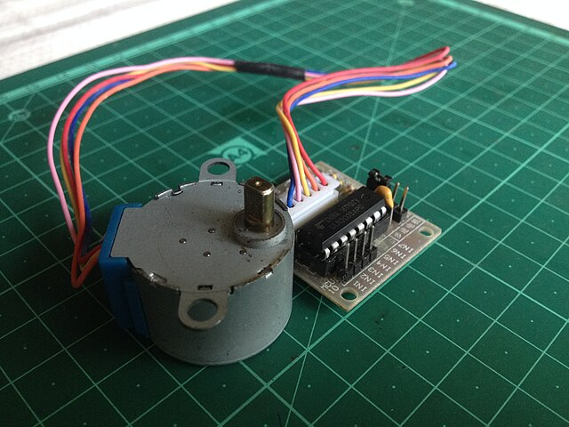
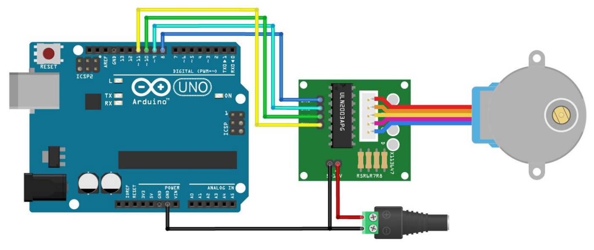
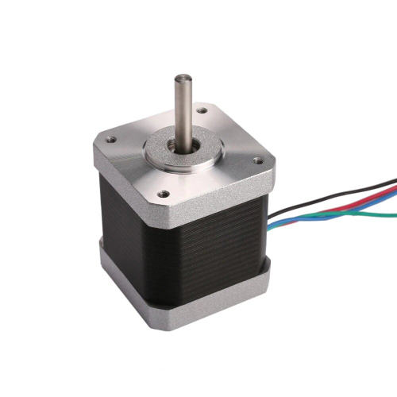

# Samm-mootorid


*Allikas: https://commons.wikimedia.org/wiki/File:28BYJ-48_unipolar_stepper_motor_with_ULN2003_driver.jpg*

Samm-mootorid *(ingl stepper-motor)* on elektrimootorid, mis liiguvad kindla nurga kaupa ehk sammudena, võimaldades täpset positsioneerimist ja kiiruse juhtimist. Neid kasutatakse näiteks 3D-printerites ja teistes automaatikaseadmetes, kus on vaja kontrollitud liikumist. Erinevalt tavalistest alalisvoolumootoritest ei tööta samm-mootor pideva pöörlemisega, vaid liigub järk-järgult etteantud sammude võrra, mida määravad mootori juhtimissüsteem ja kontroller.

Arduino UNO-ga saab samm-mootoreid juhtida spetsiaalsete draiverite, näiteks ULN2003, abil. See draiver võimaldavad genereerida vajalikke juhtsignaale ja toita mootorit vajaliku pingega, kaitstes samal ajal Arduino plaati ülekoormuse eest. Tavaliselt juhitakse samm-mootorit kahe või enama juhtsignaali abil, määrates sammude suuna ja kiiruse.

Arduino UNO abil saab samm-mootorit juhtida Stepper või AccelStepper teekide abil, mis lihtsustavad liikumise kodeerimist ja kiiruse reguleerimist. Programmikoodiga saab määrata sammude arvu, suuna ja kiirenduse, et saavutada soovitud liikumine. Kuigi samm-mootorid on väga täpsed, võivad nad kaotada samme, kui koormus on liiga suur või kiirendus liiga järsk.

## Samm-mootori 28BYJ-48 juhtiminde ULN2003 driveri ja Arduino UNO abil

28BYJ-48 on neljafaasiline (mootoril on neli mähist, millest korraga aktiveeritakse kaks), 5V nimipingega samm-mootor. Ühe sammu nurk on 11,25 kraadi ja mootori reduktsioonisuhe 1/64. See teeb ühe täispöörde sammude arvuks 2048 sammu. Mootor on võrdlemisi aeglane (kuni 15 pööret minutis 5V toitepinge juures) ja mitte eriti suure väändemomendiga (34,3 mN*m).

Selle mootori juhtimiseks sobib hästi ULN 2003 draiver, mis võimaldab ühendada lisatoiteallika ja kontrollida mootorit nelja viigu abil.
Draiveriga suhtlemiseks kasutame Stepper teeki.



~~~cpp
#include <Stepper.h> //võtame kasutusele Stepper teegi
#define in1 8
#define in2 9
#define in3 10
#define in4 11

int sammu = 2038; //samme täispöörde kohta
Stepper mootor = Stepper(sammu, in1, in3, in2, in4);
//selline veider sisendite järjestus on selle mudeli puhul oluline

void setup() {
}

void loop() {
	//teeme 1 täispöörde päripäeva, kiirusega 10 sekundit pööre 
	mootor.setSpeed(6); //kiirus on pööret/minutis
	mootor.step(sammu); //see on blokkeeriv funktsioon
	
	//teeme 2 täispööret vastupäeva kiirusega 5 sekundit pööre
	mootor.setSpeed(12);
	mootor.step(sammu*-2);
}
~~~~


See koodinäide põhineb [pikemal ja detailsemal õpetusel](https://lastminuteengineers.com/28byj48-stepper-motor-arduino-tutorial/), mida soovitan tungivalt lugeda.

## Samm-mootori MT-1701HS140A juhtiminde A4988 driveri ja Arduino UNO abil




### Toide

Arduino ja A4988 peavad kasutama **ühist GND**-d.

| A4988 pin              | Kuhu ühendada                   |
|------------------------|---------------------------------|
| VMOT                   | 12 V toite **+**                |
| GND (VMOT kõrval)      | 12 V toite **–** ja Arduino GND |
| VDD                    | Arduino **5V**                  |
| GND (VDD kõrval)       | Arduino **GND**                 |

### Juhtsignaalid A4988 ↔ Arduino

| A4988 pin | Arduino UNO pin |
|-----------|-----------------|
| STEP      | D2              |
| DIR       | D3              |
| ENABLE    | GND (draiver kogu aeg sisselülitatud) |

### Samm-mootori juhtmete ühendamine

MT-1701HS140A on **4-juhtmeline bipolaarne** samm-mootor.  
Mähisepaarid saab leida multimeetri abil (takistuse mõõtmine):

1. Leia kaks juhet, mille vahel takistus on umbes **1,9 Ω** → **mähis A**
2. Ülejäänud kaks juhet moodustavad **mähise B** (samuti ~1,9 Ω)

Seejärel ühenda:

| A4988 pin | Mootorijuhe         |
|-----------|---------------------|
| 1A        | mähis A üks ots    |
| 1B        | mähis A teine ots  |
| 2A        | mähis B üks ots    |
| 2B        | mähis B teine ots  |

Kui mootor ainult vibreerib ega pöörle, on mähised tõenäoliselt risti – kontrolli paarid uuesti.  
Kui pöörleb “vales” suunas, saab suunda muuta kas:

- koodis (DIR pin HIGH ↔ LOW),
- või vahetades ühe mähise juhtmete järjekorra (1A ↔ 1B).

### Näiteskood (Arduino)

Mootori sammusuund: 1,8° samm → **200 täissammu** ühe pöörde kohta.

```cpp
// MT-1701HS140A + A4988 + Arduino UNO

// A4988 juhtsignaalid
const int STEP_PIN = 2;   // STEP → Arduino D2
const int DIR_PIN  = 3;   // DIR  → Arduino D3

// Mootori parameetrid (täissamm)
const int STEPS_PER_REV = 200;   // 1.8° samm → 360° / 1.8° = 200 sammu
const int STEP_DELAY_US = 2000;  // 2000 µs HIGH + 2000 µs LOW → u 75 rpm

// Abifunktsioon ühe suuna sammude tegemiseks
void stepMotor(int steps, bool directionClockwise) {
  // Määrame suuna (HIGH või LOW)
  digitalWrite(DIR_PIN, directionClockwise ? HIGH : LOW);

  // Teeme etteantud arvu samme
  for (int i = 0; i < steps; i++) {
    digitalWrite(STEP_PIN, HIGH);
    delayMicroseconds(STEP_DELAY_US);   // impulsi "HIGH" aeg
    digitalWrite(STEP_PIN, LOW);
    delayMicroseconds(STEP_DELAY_US);   // impulsi "LOW" aeg
  }
}

void setup() {
  pinMode(STEP_PIN, OUTPUT);
  pinMode(DIR_PIN, OUTPUT);

  // Soovi korral võib algsuuna fikseerida
  digitalWrite(DIR_PIN, LOW);
}

void loop() {
  // 1 täispööre päripäeva
  stepMotor(STEPS_PER_REV, true);
  delay(1000);  // 1 s paus

  // 1 täispööre vastupäeva
  stepMotor(STEPS_PER_REV, false);
  delay(1000);  // 1 s paus
}
